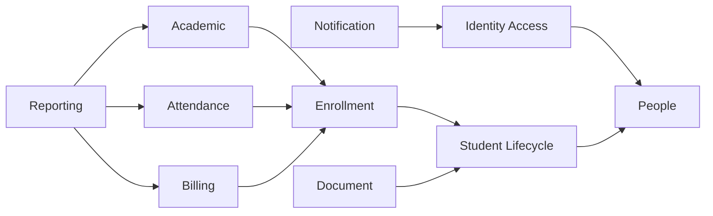
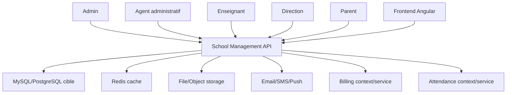
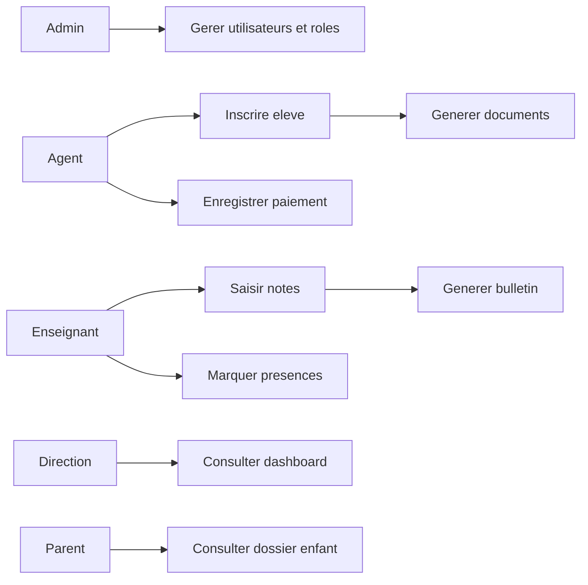
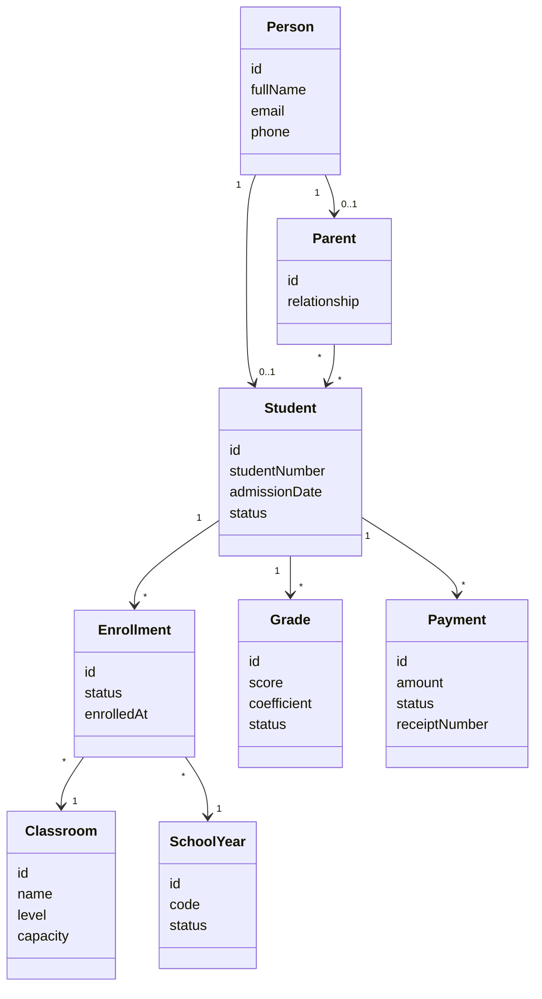
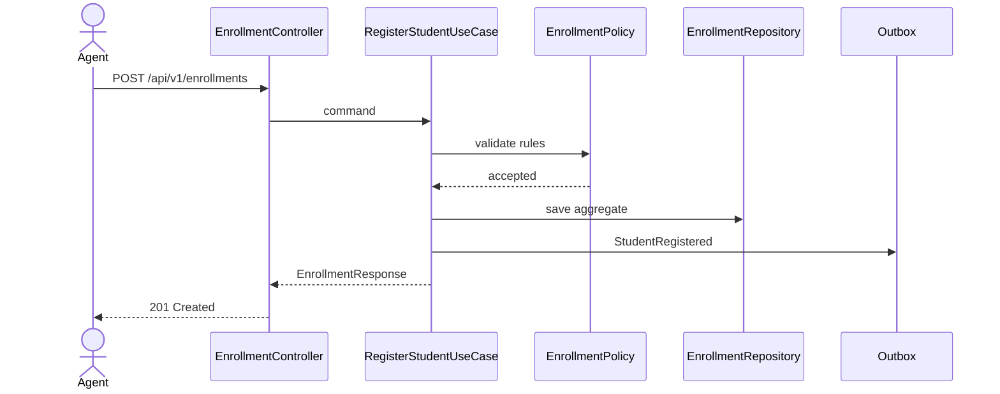
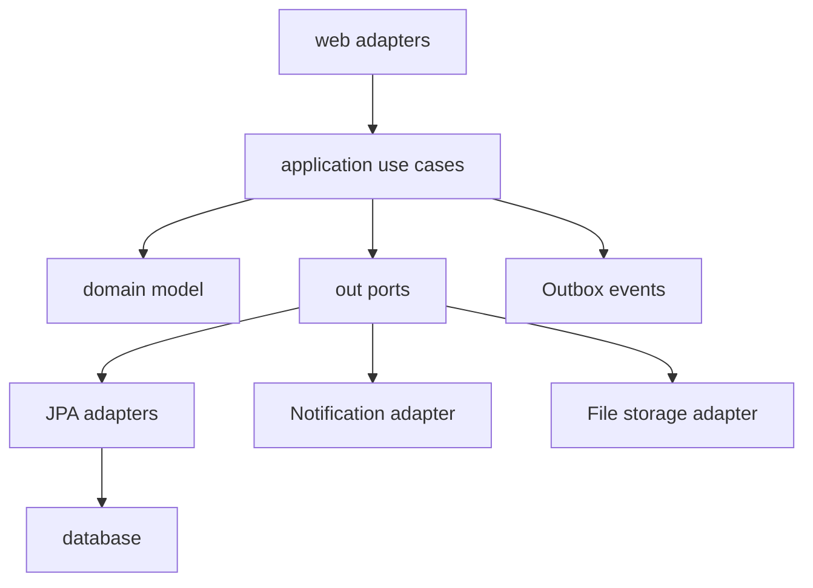
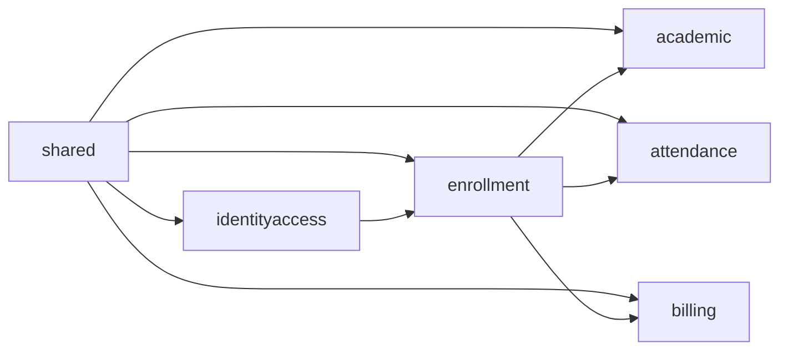

# Audit architecture backend School Management

Date: 2026-06-25  
Auditeur: Principal Software Architect / Lead Java Spring Boot / DDD  
Perimetre inspecte: `C:\Projects\Primary-School\backend`  
Verification executee: `.\gradlew.bat test`  
Resultat verification: echec a `compileJava`

## 0. Synthese executif

Le projet est un systeme de gestion scolaire construit en Java 21, Spring Boot 3.5.14, Spring Data JPA, Spring Security, JWT, Flyway et MySQL. Il contient un backend principal `school-management` et deux services en extraction progressive: `billing-service` et `attendance-service`.

Verdict architectural: le projet contient de bonnes intentions techniques, notamment Java 21, Flyway, JWT, `open-in-view=false`, Actuator, MapStruct, des DTOs et deux modules plus proches de l'architecture hexagonale. Mais il n'est pas pret pour une mise en production d'entreprise. Le build ne compile pas, le module `gestion-user` est incoherent avec son namespace, un rapport Markdown est injecte dans un fichier Java de securite, et le domaine principal reste structure en couches techniques plutot qu'en bounded contexts metier.

Decision de release recommandee: NO-GO production.

Raisons bloquantes:

| Priorite | Constat | Preuve | Impact |
|---|---|---|---|
| P0 | Le backend principal ne compile pas | `UserDetailsServiceImpl.java:29`, `ProfileAssignmentDomainService.java:134` | Impossible de livrer, tester ou deployer |
| P0 | Fichier Java corrompu par un rapport Markdown | `src/main/java/com/school/management/security/UserDetailsServiceImpl.java` | Build casse, risque de perte de confiance dans le repo |
| P0 | Module `gestion-user` copie sous mauvais namespace | fichiers sous `com/school/.../gestion-user` declarent `package com.erp.school...` | Integration DDD incomplete, imports cassants |
| P0 | Source de verite attendance ambigue | API `AttendanceController` dans le monolithe et `attendance-service` | Donnees divergentes, contrats API concurrents |
| P1 | Architecture principale non DDD | packages `controller/service/repository/model/dto` globaux | Couplage fort, faible evolutivite |
| P1 | Migration Flyway V1 vide pour le schema legacy | `V1__baseline_school_management.sql` | Modele initial non reproductible |
| P1 | API REST heterogene | routes `/subject`, `/trimestre`, `/montant`, `/api/user-accounts` | Frontend fragile, documentation difficile |
| P1 | Tests insuffisants et actuellement non executables | compileJava echoue avant tests | Regression non controlee |

## 1. Informations manquantes et hypotheses declarees

Informations manquantes:

1. Dictionnaire metier officiel de l'ecole.
2. Regles exactes d'inscription, preinscription, passage de classe et redoublement.
3. Politique tarifaire complete par section, classe, annee scolaire, remise, dette et echeancier.
4. Regles officielles de calcul des moyennes, coefficients, rangs, bulletins et sequences.
5. Modele multi-etablissement attendu ou non.
6. SLA de production: nombre d'ecoles, utilisateurs simultanes, volume historique.
7. Contrats frontend actuels et endpoints reellement consommes.
8. Strategy de deploiement reelle: Docker Compose, VM, Kubernetes ou PaaS.
9. Politique de conservation des donnees et exigences legales locales.

Hypotheses utilisees:

1. Le domaine cible est une plateforme de gestion scolaire primaire/secondaire, probablement francophone, avec inscriptions, eleves, parents, enseignants, classes, notes, absences, paiements, documents, support et tableaux de bord.
2. Le systeme vise au minimum un etablissement, avec possibilite future multi-etablissements.
3. Les deux sous-services `billing-service` et `attendance-service` representent une extraction progressive depuis le monolithe.
4. MySQL est la base actuelle. La demande mentionne PostgreSQL comme competence cible, mais le code inspecte est MySQL.

## 2. Partie 1: comprehension du projet

### Metier

Le projet gere les operations administratives et pedagogiques d'un etablissement scolaire:

- Gestion des identites: utilisateurs, roles, permissions, personnes, comptes.
- Gestion pedagogique: annees scolaires, sections, classes, matieres, enseignants, affectations.
- Gestion des eleves: dossiers, parents, inscriptions, preinscriptions, documents.
- Gestion academique: notes, sequences, trimestres, bulletins, statistiques.
- Gestion de la presence: absences, retards, justifications, syntheses.
- Gestion financiere: montants dus, paiements, recus, restes a payer.
- Gestion operationnelle: support, preferences, audit, dashboards, notifications, exports.

### Acteurs

| Acteur | Besoin principal |
|---|---|
| Admin | Configurer l'etablissement, gerer utilisateurs, roles, donnees de reference |
| Agent administratif | Inscrire eleves, gerer dossiers, paiements, documents |
| Enseignant | Consulter classes, saisir notes, suivre absences |
| Direction | Consulter dashboards, rapports, performance, finance |
| Parent | Potentiellement consulter informations enfant, paiements, absences |
| Systeme externe | Notification, frontend Angular, sous-services billing/attendance |

### Fonctionnalites deduites

Fonctionnalites presentes:

- Authentification JWT, refresh tokens, reset password.
- CRUD utilisateurs, roles, permissions, personnes, comptes.
- CRUD eleves, parents, enseignants, classes, sections, matieres.
- Inscription et preinscription d'eleves.
- Saisie et consultation des notes.
- Calculs de moyenne, rang, rapports de classe.
- Gestion des paiements.
- Gestion des absences dans le monolithe.
- Nouveau service attendance separe.
- Nouveau service billing separe.
- Export Excel/PDF.
- Support ticket et preferences.
- Dashboards direction.

Fonctionnalites incompletes ou incertaines:

- Multi-etablissement.
- Workflow complet de preinscription: brouillon, soumis, valide, rejete, converti en inscription.
- Workflow financier: facture, echeance, paiement partiel, remise, avoir, annulation, audit caisse.
- Workflow pedagogique: validation de notes, verrouillage de periode, publication bulletin.
- Gestion fine des droits par action metier.
- Historisation metier et audit trail complet.
- Documentation OpenAPI complete.
- Contrats entre monolithe et services extraits.

### Interactions entre modules

Le backend principal centralise presque tout. Les sous-services sont plus autonomes mais gardent des references par identifiants:

- `attendance-service` appelle le backend principal via `SchoolApiClassRosterAdapter` pour recuperer la liste de classe.
- `billing-service` stocke `student_id` et `student_name`, sans relation forte avec le monolithe.
- Le frontend doit probablement appeler `spring-api`, `billing-service` et `attendance-service` avec des bases URL separees.

Risque cle: les donnees eleve/classe/paiement/presence peuvent diverger si les services extraient leurs propres copies sans evenement metier ni contrat stable.

## 3. Partie 2: audit architecture actuelle

### Notes

| Aspect | Note / 10 | Justification |
|---|---:|---|
| Compilabilite | 0 | `compileJava` echoue |
| Architecture globale | 4 | Intentions modernes, mais assemblage hybride non stabilise |
| DDD | 3 | Quelques concepts dans `gestion-user` et sous-services, mais domaine principal anemique |
| SOLID | 4 | Services trop gros, controllers parfois metier, dependances directes repositories |
| Clean Architecture | 3 | Monolithe principal depend de Spring/JPA dans le coeur metier |
| Hexagonal Architecture | 5 | Bonne direction dans `billing-service` et `attendance-service`, absente du legacy |
| Modularite | 4 | Multi-projet Gradle present, mais frontieres floues |
| Maintenabilite | 3 | Nommage heterogene, duplication, code corrompu, packages incoherents |
| Evolutivite | 4 | Extraction possible, mais donnees et contrats non stabilises |
| Securite | 5 | JWT, BCrypt et method security presents, mais politique incomplete |
| Performance | 4 | Pagination partielle, cache partiel, requetes et syntheses en memoire |
| Testabilite | 3 | Tests presents mais insuffisants et non executables actuellement |
| Observabilite | 5 | Actuator/Prometheus presents, logs et correlation IDs incomplets |

### Critiques detaillees

#### C1. Build non compilable

Pourquoi c'est un probleme: aucun systeme d'entreprise ne peut etre audite pour production si le code ne compile pas.

Impact technique: impossible d'executer tests, packaging, analyse dynamique, CI/CD et deploiement.

Impact metier: livraison bloquee, aucune garantie sur les workflows critiques.

Gravite: Critique.

Solutions:

- Solution A: corriger immediatement les fichiers fautifs. Avantage: rapide. Inconvenient: ne traite pas la cause de pollution du repo.
- Solution B: isoler le module `gestion-user` hors compilation puis reintegrer proprement. Avantage: stabilise le build. Inconvenient: exige decision produit.
- Solution C: creer une branche de stabilisation avec CI obligatoire. Avantage: evite recurrence. Inconvenient: demande discipline equipe.

Recommandation finale: P0, restaurer la compilabilite avant tout autre chantier. Aucun refactoring DDD ne doit demarrer tant que `./gradlew test` ne passe pas.

#### C2. Fichier de securite corrompu par Markdown

Pourquoi: `UserDetailsServiceImpl.java` contient `@RequiredArgsConstructor# AUDIT PROFESSIONNEL...` puis un rapport complet avant le code Java.

Impact technique: compilation impossible, analyse statique polluee, risque de conflit de merge.

Impact metier: authentification indisponible.

Gravite: Critique.

Solutions:

- Extraire le rapport vers un fichier `.md`.
- Restaurer `UserDetailsServiceImpl.java` a sa classe Java uniquement.
- Ajouter en CI une verification `./gradlew compileJava` et un check interdisant Markdown brut dans `src/main/java`.

Recommandation finale: supprimer le contenu Markdown du Java et versionner le rapport dans `docs/` ou racine.

#### C3. Module `gestion-user` non integre

Pourquoi: les fichiers sous `src/main/java/com/school/management/gestion-user` declarent `package com.erp.school...`.

Impact technique: packages inattendus, imports incoherents, scan Spring et JPA non maitrises, risque de classes non trouvees.

Impact metier: le futur domaine identite/profil ne peut pas etre considere fiable.

Gravite: Critique.

Solutions:

- Renommer tous les packages vers `com.school.management.identity` ou `com.school.identity`.
- Extraire en module Gradle dedie `identity-service` ou `identity-context`.
- Mettre ce code en quarantaine hors `src/main/java` tant qu'il ne compile pas.

Recommandation finale: quarantine puis reintegration en bounded context `identity-access`.

#### C4. Architecture hybride non gouvernee

Pourquoi: le monolithe principal est en couches techniques; les sous-services sont ports/adapters; `gestion-user` tente une DDD mais avec mauvais namespace.

Impact technique: les equipes ne sauront pas quel pattern suivre.

Impact metier: evolution lente, bugs aux frontieres, cout de maintenance croissant.

Gravite: Eleve.

Recommandation: choisir une architecture cible unique: modular monolith DDD en premier, microservices seulement apres stabilisation des bounded contexts.

## 4. Partie 3: audit de l'arborescence

### Arborescence actuelle observee

```text
backend/
|-- build.gradle
|-- settings.gradle
|-- src/main/java/com/school/
|   |-- SchoolManagementApplication.java
|   |-- management/
|   |   |-- config/
|   |   |-- controller/
|   |   |-- dto/
|   |   |-- enums/
|   |   |-- mappers/
|   |   |-- model/
|   |   |-- repository/
|   |   |-- security/
|   |   |-- service/
|   |   |-- gestion-user/
|   |   |-- shared/
|   |-- service/
|   |-- validator/
|-- services/
|   |-- billing-service/
|   |-- attendance-service/
```

Problemes:

- Packages par couche technique, pas par domaine.
- Services transverses hors `com.school.management`.
- Dossier `gestion-user` avec tiret dans le chemin, non idiomatique Java.
- Package declare `com.erp.school` dans un chemin `com/school`.
- Duplication de `ErrorResponse`, exceptions et `BaseEntity`.
- Module root et sous-services dupliquent dependances Gradle.
- `node_modules` present dans un backend Java, ce qui doit etre exclu du livrable Java.

### Arborescence cible recommandee

Option recommandee: modular monolith DDD, pret a extraction microservice.

```text
rc/main/java/com/school/platform/
|-- SchoolPlatformApplication.java
|-- shared/
|   |-- domain/
|   |-- application/
|   |-- infrastructure/
|   |-- web/
|-- identityaccess/
|   |-- domain/
|   |-- application/
|   |-- infrastructure/
|   |-- web/
|-- academic/
|   |-- domain/
|   |-- application/
|   |-- infrastructure/
|   |-- web/
|-- enrollment/
|   |-- domain/
|   |-- application/
|   |-- infrastructure/
|   |-- web/
|-- billing/
|   |-- domain/
|   |-- application/
|   |-- infrastructure/
|   |-- web/
|-- attendance/
|   |-- domain/
|   |-- application/
|   |-- infrastructure/
|   |-- web/
|-- document/
|-- notification/
|-- reporting/s
```

Regle: aucun domaine ne depend d'un autre domaine via entites JPA. Les interactions passent par ports, services applicatifs ou evenements.

## 5. Partie 4: audit du domaine

### Bounded contexts recommandes

| Bounded context | Responsabilite | Aggregate roots |
|---|---|---|
| Identity & Access | comptes, roles, permissions, authentification | UserAccount, Role, Permission |
| People | personne, adresse, contact | Person |
| Student Lifecycle | eleve, parents, dossier | Student, Parent |
| Enrollment | annee scolaire, classe, inscription, preinscription | Enrollment, SchoolYear, ClassRoom |
| Academic | matieres, sequences, notes, bulletins | GradeBook, Grade, ReportCard |
| Attendance | presence, absence, justification | AttendanceSheet, AttendanceRecord |
| Billing | frais, facture, paiement, recu | Invoice, Payment, FeeSchedule |
| Document | pieces jointes, photos, recus, bulletins | Document |
| Notification | email, push, websocket | Notification |
| Reporting | tableaux de bord, exports | Read models |
| Support | tickets, help center | SupportTicket |

### Probleme de domaine principal

Le domaine legacy utilise des entites JPA comme modeles metier. Les invariants sont disperses dans services, validators, controllers et annotations Bean Validation. Cela donne un modele anemique.

Exemples:

- `GradeService` contient calculs, validation, mapping de relations, notification et reporting.
- `AttendanceController` contient orchestration, validation payload, mutation JPA et mapping reponse.
- `Paiement` expose des champs financiers sans objet valeur `Money`.
- `InscriptionStudent` porte un statut sous forme `String` au lieu d'une enum/value object.
- `Student` reference `Person`, mais certains usages attendent encore `getFirstNameStudent()` et `getLastNameStudent()`, signal d'un modele migre partiellement.

### Ce qui manque

- Value Objects: `Money`, `StudentNumber`, `SchoolYearCode`, `GradeScore`, `Coefficient`, `ReceiptNumber`, `PhoneNumber`, `EmailAddress`.
- Domain Events: `StudentRegistered`, `PreEnrollmentApproved`, `GradeRecorded`, `PaymentReceived`, `AttendanceMarked`, `AbsenceJustified`.
- Domain Services: `GradePolicy`, `EnrollmentPolicy`, `BillingPolicy`, `AttendancePolicy`.
- Factories: `StudentRegistrationFactory`, `InvoiceFactory`, `ReportCardFactory`.
- Aggregates explicites et invariants dans les aggregates.
- Anti-corruption layer entre monolithe et sous-services.

### Ce qui doit etre deplace

- Les validations metier depuis controllers vers use cases ou domain services.
- Les calculs de bulletin depuis `GradeService` vers `Academic` domain/application.
- La logique attendance du monolithe vers `attendance` context ou service dedie.
- Les paiements legacy vers `billing` context.
- Les exceptions dupliquees vers `shared`.

## 6. Partie 5: audit base de donnees

### Etat observe

Base principale:

- MySQL.
- Flyway active par defaut.
- `V1__baseline_school_management.sql` ne cree pas le schema, il documente seulement un baseline legacy.
- Migrations V2 a V12 ajoutent preferences, support, refresh tokens, absences, favoris, champs paiement, champs CNI/photo, statut preinscription, corrections d'enum et indexes.

Sous-services:

- `billing-service`: table `payments`, indexes sur student, status, type, payment_date.
- `attendance-service`: table `attendance_records`, unique `(student_id, class_id, attendance_date)`, indexes class/date, student, status, justified.

### Risques donnees

| Risque | Gravite | Pourquoi |
|---|---|---|
| Schema legacy non reproductible | Eleve | V1 ne cree pas les tables de base |
| MySQL enum dans migrations | Moyen | Migration plus rigide et moins portable |
| Naming incoherent | Eleve | `inscription_student`, `inscriptionStudent`, `anneescolaire_id`, `classe_room_id` |
| Montants financiers sans contraintes fortes partout | Eleve | Risque d'erreur comptable |
| Absence de tenant/school id | Eleve si multi-etablissement | Isolation impossible |
| Historisation partielle | Moyen | Audit metier incomplet |
| Soft delete non uniforme | Moyen | Suppression non maitrisee |
| V2 attendance migre depuis `bd_gsbp.inscriptionStudent` | Eleve | Le code/migrations principales parlent de `inscription_student` |

### Compatibilite DDD

Le modele actuel n'est pas pleinement compatible DDD, car les tables suivent surtout les entites JPA legacy. Il peut servir de base de transition, mais le modele cible doit etre derive des aggregates et non l'inverse.

### Modele relationnel cible

Tables structurantes:

```text
schools(id, code, name, status, created_at, updated_at)
persons(id, school_id, first_name, last_name, email, phone, birth_date, gender, address_id)
user_accounts(id, school_id, person_id, username, password_hash, enabled, locked, last_login_at)
roles(id, school_id, code, name)
permissions(id, code, resource, action)
role_permissions(role_id, permission_id)
students(id, school_id, person_id, student_number, admission_date, status)
parents(id, school_id, person_id)
student_parents(student_id, parent_id, relationship_type, primary_contact)
school_years(id, school_id, code, start_date, end_date, status)
sections(id, school_id, code, name)
classrooms(id, school_id, school_year_id, section_id, name, level, capacity, main_teacher_id)
enrollments(id, school_id, student_id, classroom_id, school_year_id, status, enrolled_at)
subjects(id, school_id, code, name, coefficient)
teaching_assignments(id, school_id, teacher_id, classroom_id, subject_id, school_year_id)
periods(id, school_id, school_year_id, type, code, start_date, end_date, locked)
grades(id, school_id, student_id, subject_id, classroom_id, period_id, score, coefficient, status, version)
attendance_records(id, school_id, student_id, classroom_id, attendance_date, status, hours, justified, note)
fee_schedules(id, school_id, classroom_id, school_year_id, fee_type, amount)
invoices(id, school_id, enrollment_id, total_amount, paid_amount, remaining_amount, status)
payments(id, school_id, invoice_id, student_id, amount, method, receipt_number, paid_at, status, version)
documents(id, school_id, owner_type, owner_id, document_type, storage_key, checksum, status)
notifications(id, school_id, recipient_id, channel, subject, body, status)
audit_log(id, school_id, actor_id, action, resource_type, resource_id, before_json, after_json, created_at)
outbox_events(id, school_id, aggregate_type, aggregate_id, event_type, payload_json, status, created_at)
```

Indexes obligatoires:

- `students(school_id, student_number)` unique.
- `persons(school_id, email)` unique nullable selon politique.
- `enrollments(school_id, student_id, school_year_id)` unique actif.
- `grades(school_id, student_id, subject_id, period_id, classroom_id)` unique.
- `attendance_records(school_id, student_id, classroom_id, attendance_date)` unique.
- `payments(school_id, receipt_number)` unique.
- Tous les FKs indexees.

## 7. Partie 6: audit code

### Resultat build

Commande:

```powershell
.\gradlew.bat test
```

Resultat: `BUILD FAILED` pendant `:compileJava`.

Erreurs bloquantes:

- `src/main/java/com/school/management/security/UserDetailsServiceImpl.java:29`: caractere `#` apres `@RequiredArgsConstructor`.
- `src/main/java/com/school/management/gestion-user/domain/service/ProfileAssignmentDomainService.java:134`: `for (Role role : rolesToAssign) {-`.

### Audit classe par classe des composants lus en profondeur

| Classe | Role | Bonnes pratiques | Mauvaises pratiques | Qualite |
|---|---|---|---|---|
| `SecurityConfig` | Filtre securite principal | Stateless, CORS config, BCrypt 12, Swagger coupe en prod | Reponses JSON construites a la main, endpoints publics disperses | Moyen |
| `JwtService` | Generation/validation JWT | Secret valide au demarrage, HS256 >= 32 octets, refresh typ/jti | Pas de rotation de cle, pas de issuer/audience, JJWT 0.11.5 ancien | Moyen+ |
| `UserDetailsServiceImpl` | Chargement user details | Devrait utiliser `@EntityGraph` via repository | Fichier corrompu par Markdown, imports inutiles | Critique |
| `GlobalExceptionHandler` | Erreurs API | Advice global, mapping de plusieurs exceptions | Deux familles d'exceptions, fuite possible `DataIntegrityViolation` brute, format different des security handlers | Moyen |
| `Student` | Aggregate potentiel eleve | Relation vers `Person`, `studentNumber` unique, equals limite | Entite JPA anemique, pas de constructeur invariant, relation parents exposee | Moyen |
| `Person` | Identite civile | Bean Validation, email unique | Adresse aplatie, email unique global non tenant-aware | Moyen |
| `Users` | Compte legacy | Implements UserDetails, actif, timestamps | Mot de passe soumis a regex sur hash potentiel, roles via profils legacy, pas de lock/account expiry | Moyen- |
| `Grade` | Note academique | Score contraint 0-20, LAZY, version | Pas de value object GradeScore, period string, doublon sequence/trimestre/period | Moyen |
| `Paiement` | Paiement legacy | Version optimiste, BigDecimal | Pas de Money, status absent, montant restant derive stocke sans invariant | Moyen- |
| `InscriptionStudent` | Inscription | Version, defaults | Nom `DateInscription`, status string, cascade PERSIST vers student, invariants faibles | Moyen- |
| `ClasseRoom` | Classe | Relations section/teacher/year | Champs nullable importants, pas de contrainte capacite, active/audit partiels | Moyen |
| `BaseEntity` legacy | ID, active, timestamps | PrePersist/PreUpdate simples | Pas de `@Version`, pas de createdBy/updatedBy, doublon avec autres BaseEntity | Moyen |
| `AttendanceController` monolithe | API presence legacy | Quelques validations, requetes par dates | Controller contient logique metier, transactions, Map payload/reponse, doublon avec service dedie | Faible |
| `GradeService` | Notes/reporting | Transactions, cache, pagination partielle | Trop de responsabilites, calculs en memoire, notification couplee, Map responses | Moyen |
| `AttendanceApplicationService` | Use case attendance | Ports/adapters, domaine record, fallback roster | Repository retourne List non paginee, synthese en memoire | Moyen+ |
| `PaymentApplicationService` | Use case billing | Domaine `Payment`, `Money`, ports | Listing et summary non pagines, recu texte simpliste, pas de transaction explicite | Moyen+ |
| `StudentRepository` | Repository eleves | Pageable pour quelques methodes | `List<Student> findByActiveTrue()`, commentaires morts, methodes derivees sur champs potentiellement absents | Moyen- |
| `ProfileAssignmentDomainService` | Assignation profil DDD | Intention domain service | Mauvais package, imports `com.erp`, caractere parasite, depend de Spring dans domaine | Critique |

### Audit par type

Controllers:

- Trop de `ResponseEntity<?>`, `Map<String,Object>`, payloads non types.
- Plusieurs controllers contiennent de la logique metier ou des requetes repositories.
- Pagination absente sur plusieurs collections.
- Codes HTTP parfois incoherents: update retourne `201 CREATED` dans certains controllers.
- Routes heterogenes.

Services:

- Couche service riche mais non separee application/domain.
- `GradeService` et `AttendanceController` montrent une concentration de responsabilites.
- Transactions presentes mais parfois au mauvais niveau.
- Notifications couplees aux use cases synchrones.

Repositories:

- Spring Data JPA direct dans le coeur applicatif.
- Quelques `JOIN FETCH` et `EntityGraph`, bon point.
- Plusieurs `findAll()` non pagines ou syntheses en memoire.

DTO:

- Beaucoup de DTOs, separation utile.
- Styles melanges: classes Lombok, records, DTO Basic/Medium/Full.
- Validation inegale.

Mappers:

- MapStruct present, bonne base.
- Risque de mapping entites lazy vers DTOs sans fetch plan explicite.

Entities:

- Beaucoup d'entites JPA anemiques.
- Auditing non uniforme.
- Nommage mixte francais/anglais.
- Quelques relations LAZY correctement utilisees.

Configuration:

- `application.properties` expose des defaults de dev.
- `application-prod.properties` desactive Swagger, bon point.
- Redis configure, mais il faut verifier son usage operationnel.

Tests:

- Tests declares mais build casse avant execution.
- Couverture insuffisante pour le nombre de controllers/services/repositories.

## 8. Partie 7: audit API REST

Forces:

- Usage general de Spring MVC.
- `@PreAuthorize` present sur plusieurs endpoints.
- Quelques endpoints CRUD propres.
- Sous-services exposent des routes plus coherentes: `/payments`, `/attendance`.

Problemes:

- Pas de version API globale `/api/v1`.
- Routes singulier/pluriel melangees: `/subject`, `/trimestre`, `/sequence`, `/montant`, `/students`.
- `UserAccountController` declare `/api/user-accounts` alors que le context path est deja `/api`, risque `/api/api/user-accounts`.
- Payloads `Map<String,Object>` pour attendance et status user.
- Pagination non standardisee.
- Tri/filtrage non uniformes.
- Erreur API non uniforme entre security handlers, monolithe et sous-services.
- Documentation OpenAPI partielle, Swagger public hors prod seulement.

Convention cible:

```text
/api/v1/students
/api/v1/students/{studentId}
/api/v1/students/{studentId}/enrollments
/api/v1/classrooms
/api/v1/classrooms/{classroomId}/attendance-records
/api/v1/grades
/api/v1/report-cards
/api/v1/invoices
/api/v1/payments
```

Toutes les listes doivent accepter:

```text
page, size, sort, filter...
```

Toutes les erreurs doivent suivre:

```json
{
  "timestamp": "...",
  "status": 400,
  "code": "VALIDATION_ERROR",
  "message": "...",
  "details": [],
  "path": "...",
  "correlationId": "..."
}
```

## 9. Partie 8: audit securite

Forces:

- Spring Security active.
- JWT stateless.
- BCrypt cost 12.
- Validation du secret JWT au demarrage.
- Swagger desactive en profil prod.
- Method security active.

Risques:

| Risque | Gravite | Recommandation |
|---|---|---|
| Build casse dans classe securite | Critique | Restaurer `UserDetailsServiceImpl` |
| JWT sans issuer/audience | Moyen | Ajouter `iss`, `aud`, validation stricte |
| Pas de rotation de cle | Moyen | Introduire `kid` et key management |
| Refresh token a auditer | Moyen | Stocker hash, rotation, revocation, reuse detection |
| Reset password | Eleve | Token hash, expiration courte, rate limit |
| Pas de rate limiting visible | Moyen | Ajouter filtre sur login/reset |
| CORS credentials true | Moyen | Restreindre par env et tester |
| Erreurs SQL brutes possibles | Moyen | Mapper les violations vers messages metier |
| Absence de tenant isolation | Eleve si multi-ecole | Ajouter `school_id` et controle d'autorisation |

## 10. Partie 9: audit performance

Risques principaux:

- `findAll()` non pagines dans plusieurs services et sous-services.
- Syntheses `PaymentApplicationService.summarize()` et `AttendanceApplicationService.summarize()` en memoire.
- `GradeService` calcule rangs, moyennes, rapports avec listes en memoire.
- DTO mapping peut declencher N+1 si fetch plan non maitrise.
- Cache grade existe mais invalidation globale `allEntries=true`.
- Exports Excel/PDF peuvent charger trop de donnees.
- Pas de read models dedies pour dashboards.

Recommandations:

1. Pagination obligatoire sur toutes les collections.
2. Requetes aggregate SQL pour dashboards et summaries.
3. `@EntityGraph` ou projections DTO pour ecrans listes.
4. Index par use case, pas seulement par FK.
5. Cache Redis avec TTL par domaine.
6. Jobs asynchrones pour exports lourds.
7. Tests de charge avant production.

## 11. Partie 10: audit DDD

### Ubiquitous Language propose

| Terme | Definition |
|---|---|
| Person | Identite civile partagee |
| Student | Profil eleve rattache a une personne |
| Parent | Responsable legal rattache a une personne |
| SchoolYear | Annee scolaire |
| Classroom | Classe administrative |
| Enrollment | Inscription d'un eleve dans une classe pour une annee |
| PreEnrollment | Demande ou preinscription avant validation |
| Subject | Matiere enseignee |
| Period | Sequence ou trimestre d'evaluation |
| Grade | Note d'un eleve pour une matiere/periode |
| ReportCard | Bulletin |
| AttendanceRecord | Pointage presence/absence/retard |
| Invoice | Dette/facture scolaire |
| Payment | Encaissement |
| Receipt | Recu de paiement |

### Context map



### Domain events

```text
PersonCreated
UserAccountCreated
StudentRegistered
ParentLinkedToStudent
PreEnrollmentSubmitted
PreEnrollmentApproved
EnrollmentCreated
ClassroomAssigned
GradeRecorded
ReportCardPublished
AttendanceMarked
AbsenceJustified
InvoiceIssued
PaymentReceived
ReceiptGenerated
DocumentUploaded
NotificationRequested
```

## 12. Partie 11: recommandations

### Critique

1. Restaurer le build: corriger `UserDetailsServiceImpl` et `ProfileAssignmentDomainService`.
2. Mettre `gestion-user` en quarantaine ou corriger tous les packages.
3. Decider la source de verite attendance: monolithe ou service.
4. Aligner les migrations pour que le schema soit reproductible.
5. Ajouter CI obligatoire: compile, tests, format, arch rules.

### Important

1. Migrer le monolithe principal vers modular monolith DDD.
2. Standardiser API REST et erreurs.
3. Ajouter pagination partout.
4. Introduire `school_id` si multi-etablissement vise.
5. Ajouter tests WebMvc, service, repository Testcontainers.
6. Externaliser et documenter les secrets/env vars.
7. Creer une strategie d'evenements et outbox.

### Optionnel

1. Extraire billing et attendance seulement apres stabilisation contrats.
2. Ajouter cache distribue par read model.
3. Ajouter OpenAPI contract tests.
4. Ajouter observabilite: correlation ID, logs JSON, tracing.

### Innovation

1. Reporting asynchrone et read models.
2. Notifications evenementielles.
3. Audit trail consultable par direction.
4. Prediction decrochage/risque financier seulement apres qualite des donnees.

## 13. Partie 12: roadmap

### Etape 1: Stabilisation build et hygiene repo

- Corriger fichiers Java corrompus.
- Retirer `node_modules` du backend si non necessaire.
- Ajouter `.gitignore` strict.
- CI: `./gradlew clean test`.
- Definition of Done minimale.

### Etape 2: Contrats et schema

- Inventorier endpoints consommes par frontend.
- Stabiliser `/api/v1`.
- Creer baseline Flyway reproductible.
- Documenter modeles et conventions.

### Etape 3: Securite production

- Secrets obligatoires.
- Rate limiting auth.
- Refresh token rotation.
- Politique roles/permissions.
- Audit logs.

### Etape 4: Modular monolith DDD

- Creer packages par bounded context.
- Introduire ports et use cases.
- Sortir logique metier des controllers.
- Ajouter ArchUnit.

### Etape 5: Donnees et performance

- Pagination et projections.
- Index par use case.
- Read models dashboards.
- Cache Redis cible.

### Etape 6: Tests entreprise

- Unit tests domain.
- Application tests.
- WebMvc/security tests.
- Repository tests Testcontainers.
- Contract tests API.

### Etape 7: Extraction controlee

- Attendance et billing deviennent services officiels uniquement quand contrats, events et migration data sont valides.
- Mise en place outbox/inbox.
- Monitoring inter-services.

### Etape 8: Production readiness

- Docker/Kubernetes manifests.
- Health checks dependances.
- Backups/restores.
- Runbooks.
- Tests charge/securite.

## 14. Partie 13: architecture cible

Architecture cible recommandee: modular monolith DDD, deployable comme un seul backend au depart, pret a extraction microservices.

Pourquoi:

- Le domaine n'est pas encore stabilise.
- Les frontieres metier doivent etre clarifiees avant microservices.
- Les microservices trop tot augmentent la complexite donnees, reseau, auth et monitoring.
- Un modular monolith impose les bonnes frontieres tout en gardant la simplicite operationnelle.

Principes:

1. Domaine sans dependance Spring.
2. Application services orchestrent les use cases.
3. Infrastructure adapte persistence, messaging, fichiers, notifications.
4. Web adapte REST vers commands/queries.
5. Communication inter-context via ports ou events.
6. Une base initiale possible, mais schemas/tables separes par contexte.
7. Outbox pour integration future.

## 15. Partie 14: livrables

### Diagramme de contexte



### Diagramme de cas d'utilisation



### Diagramme de classes domaine cible



### Diagramme de sequence: inscription eleve



### Diagramme de composants



### Diagramme de packages



### Conventions de codage

1. Packages par bounded context.
2. Noms anglais pour code technique, vocabulaire metier stable.
3. DTO suffixes: `Request`, `Response`, `Command`, `Query`.
4. Entites JPA uniquement en infrastructure si Clean Architecture stricte.
5. Pas de `Map<String,Object>` dans les APIs publiques.
6. Pas de `findAll()` sans pagination.
7. Pas de logique metier dans controllers.
8. Pas de secrets par defaut de production.
9. Toute nouvelle route documentee OpenAPI.
10. Toute regle metier critique testee.

### Regles d'architecture

1. `domain` ne depend de rien sauf Java.
2. `application` depend de `domain` et ports.
3. `infrastructure` depend de `application` et frameworks.
4. `web` depend de `application`, pas de repositories.
5. Un bounded context ne lit pas directement les tables d'un autre contexte.
6. Les integrations passent par ports ou events.
7. Les transactions sont au niveau use case.
8. Les exceptions techniques ne sortent pas de l'API.
9. Les migrations Flyway sont la source de verite schema.
10. Le build doit passer avant tout merge.

### Bonnes pratiques obligatoires

- CI obligatoire.
- Tests unitaires domaine.
- Tests integration repositories.
- Tests securite.
- Validation Bean Validation sur DTO request.
- Logs structures avec correlation ID.
- OpenAPI a jour.
- Migrations idempotentes uniquement quand necessaire et documentees.
- Secrets via environnement/secret manager.
- Read models pour dashboards lourds.

### Anti-patterns a eviter

- Rapport Markdown dans `src/main/java`.
- Package declare different du chemin source.
- Entites JPA comme API response.
- Controllers transactionnels.
- `Map<String,Object>` comme contrat public.
- Services de 300+ lignes multi-responsabilites.
- `findAll()` sur tables metier.
- `ddl-auto=update` en environnement partage.
- Microservices sans ownership des donnees.
- Duplication d'exceptions, DTO erreurs et BaseEntity.

### Checklist validation nouveau developpement

1. Le build `./gradlew clean test` passe.
2. La fonctionnalite appartient a un bounded context identifie.
3. Les routes sont sous `/api/v1`.
4. Les DTO request/response sont types et valides.
5. Aucune logique metier dans le controller.
6. Les transactions sont au niveau use case.
7. Les listes sont paginees.
8. Les requetes lourdes ont index/projection.
9. Les erreurs suivent le format standard.
10. Les droits sont testes.
11. Les migrations Flyway couvrent le schema.
12. Les invariants sont testes au niveau domaine.
13. Les evenements/outbox sont emis si un autre contexte depend du changement.
14. Les logs ne contiennent pas de secrets.
15. La documentation OpenAPI est mise a jour.

## 16. Plan d'action immediat

Ordre strict recommande:

1. Deplacer le contenu Markdown de `UserDetailsServiceImpl.java` hors du code et restaurer la classe.
2. Corriger `ProfileAssignmentDomainService.java:134`.
3. Decider si `gestion-user` est retire temporairement ou renomme/reintegre.
4. Relancer `.\gradlew.bat clean test`.
5. Une fois le build vert, lancer un audit ligne par ligne complet des classes restantes avec les tests executables.
6. Stabiliser les contrats API utilises par le frontend.
7. Demarrer la migration DDD par un seul contexte pilote: `attendance` ou `billing`, pas tous en meme temps.
