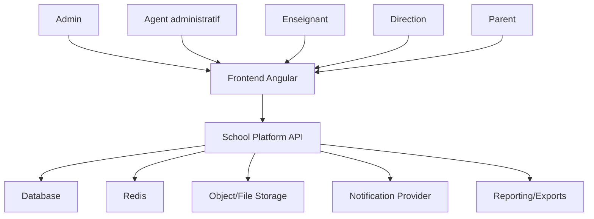
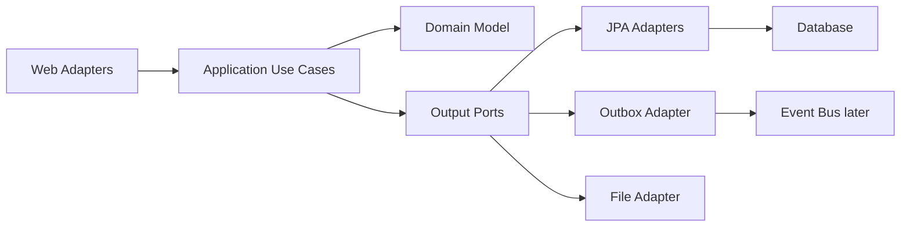
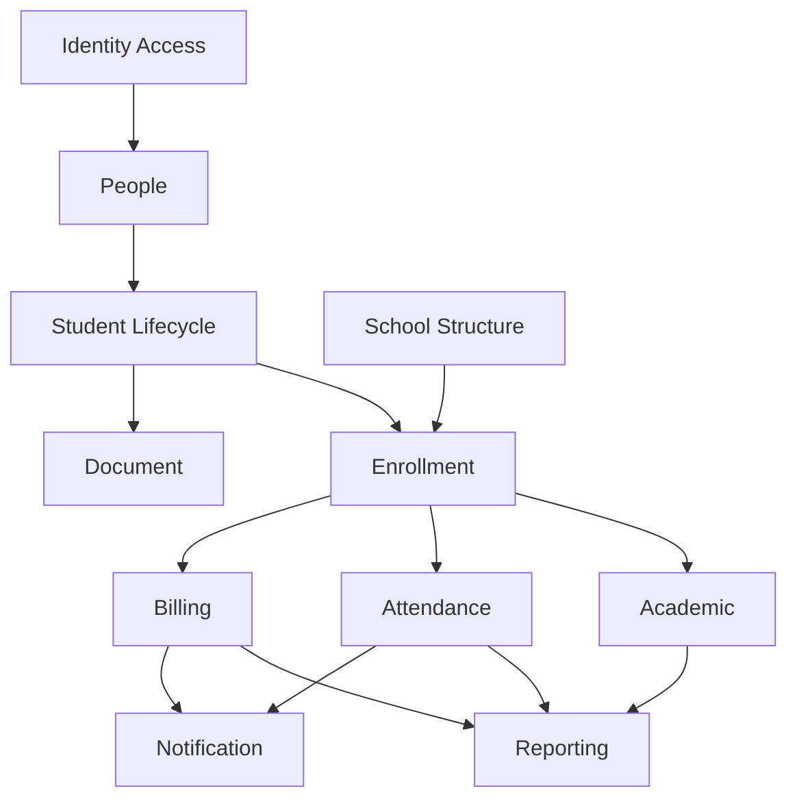
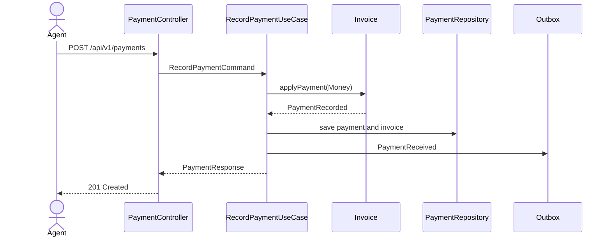

# Audit architecture V2 et plan de refactoring complet

Date: 2026-06-29  
Projet audite: `C:\Projects\Primary-School\backend`  
Stack observee: Java 21, Spring Boot 3.5.14, Gradle multi-project, Spring Data JPA, Spring Security, JWT, Flyway, MySQL, Redis, Actuator, MapStruct, Lombok  
Commande de verification: `.\gradlew.bat test`  
Resultat: echec a `:compileJava`

## 1. Resume executif

Le projet est une plateforme de gestion scolaire qui couvre l'administration, les eleves, les parents, les enseignants, les classes, les inscriptions, les notes, les presences, les paiements, les documents, les notifications, le support et les tableaux de bord.

Le depot montre une intention claire de monter en maturite: Java 21, Spring Boot 3, Flyway, JWT, Actuator, Redis, DTOs, MapStruct, et deux services extraits (`billing-service`, `attendance-service`) en architecture ports/adapters. Mais l'etat actuel n'est pas stable: le backend principal ne compile pas, le refactoring de packages est incomplet, et plusieurs morceaux DDD/hexagonaux coexistent sans gouvernance.

Verdict: **NO-GO production et NO-GO gros refactoring fonctionnel tant que le build n'est pas restaure**.

La recommandation principale n'est pas de "tout transformer en microservices". La bonne strategie est:

1. Stabiliser le build.
2. Mettre en quarantaine le code experimental.
3. Revenir a une base executable.
4. Migrer vers un modular monolith DDD.
5. Extraire des microservices uniquement quand les bounded contexts, contrats API, evenements et donnees sont stabilises.

## 2. Etat actuel verifie le 2026-06-29

### 2.1 Build

La commande `.\gradlew.bat test` echoue a `compileJava`.

Erreurs actuelles:

```text
ProfileAssignmentDomainService.java:134: error: not a statement
for (Role role : rolesToAssign) {-

ProfileAssignmentDomainService.java:135: error: '.class' expected
boolean alreadyHasRole = user.getUserRoles().stream()

UserDetailsServiceImpl.java:30: error: class, interface, enum, or record expected
blic class UserDetailsServiceImpl implements UserDetailsService {
```

Interpretation:

- Le fichier `UserDetailsServiceImpl.java` a ete partiellement nettoye par rapport au precedent audit, mais il reste syntaxiquement invalide (`blic class` au lieu de `public class`).
- `ProfileAssignmentDomainService.java` contient encore le caractere parasite `-`.
- Les tests ne peuvent pas encore donner d'information qualite, car le code ne compile pas.

### 2.2 Etat Git

Le depot contient de nombreuses modifications non commitees, des suppressions, des ajouts non suivis et des deplacements partiels. Cela signifie que l'audit porte sur un worktree en transition, pas sur une version stabilisee.

Constats importants:

- `src/main/java/com/school/SchoolManagementApplication.java` est supprime.
- Un fichier `src/main/SchoolManagementApplication.java` existe, mais il est hors arborescence Java standard.
- `src/main/java/com/school/config/SecurityConfig.java` existe physiquement sous `com/school/config`, mais declare `package com.school.management.config`.
- `src/main/java/com/school/shared/...` existe physiquement sous `com/school/shared`, mais plusieurs fichiers declarent encore `package com.school.management.shared...`.
- `gestion-user` contient encore de nombreux fichiers declarant `package com.erp.school...`.
- `node_modules/` est present dans un backend Java.

Conclusion: un refactoring de packages a commence, mais il est mecanique et non termine. Il faut le stopper, stabiliser, puis reprendre avec une strategie.

## 3. Comprehension metier

### 3.1 Domaine fonctionnel

Le systeme gere une ecole ou un groupe d'ecoles:

- Identite et acces: utilisateurs, roles, permissions, JWT, reset password.
- Personnes: informations civiles, contacts, adresses.
- Eleves: dossier eleve, numero matricule, admission, statut.
- Parents: responsables legaux, lien parent-eleve.
- Personnel: enseignants, employes, positions/fonctions.
- Structure scolaire: annees scolaires, sections, classes, matieres.
- Inscriptions: preinscriptions, inscriptions, affectation classe/annee.
- Academique: sequences, trimestres, notes, coefficients, moyennes, rangs, bulletins.
- Presences: absences, retards, justifications, syntheses.
- Finance: montants, paiements, recus, reste a payer.
- Documents: photos, CNI, recus, bulletins.
- Reporting: dashboards direction, statistiques, exports PDF/Excel.
- Support et parametrage: preferences, tickets support.
- Notifications: push, websocket, messages systeme.

### 3.2 Acteurs

| Acteur | Responsabilites probables |
|---|---|
| Administrateur | Configure l'ecole, roles, permissions, utilisateurs |
| Direction | Suit performance academique, finance, effectifs, presences |
| Agent administratif | Gere inscriptions, dossiers, paiements, documents |
| Enseignant | Consulte classes, saisit notes, marque presences |
| Parent | Suit enfant, paiements, absences, documents |
| Eleve | Consultation future possible |
| Systeme externe | Frontend Angular, services billing/attendance, notification, stockage |

### 3.3 Besoins implicites

1. Verrouillage des periodes academiques.
2. Historisation des modifications sensibles.
3. Audit des paiements et recus.
4. Gestion des paiements partiels.
5. Gestion des remises et dettes.
6. Validation des notes avant publication.
7. Publication de bulletins.
8. Isolation des donnees si plusieurs etablissements.
9. Permissions fines par role et par action.
10. API stable pour le frontend.
11. Export asynchrone pour gros volumes.
12. Sauvegarde/restauration et traçabilite.

## 4. Diagnostic architecture

### 4.1 Notes par axe

| Axe | Note | Justification |
|---|---:|---|
| Compilabilite | 0/10 | `compileJava` echoue |
| Architecture globale | 4/10 | Intentions modernes mais execution instable |
| DDD | 3/10 | Bounded contexts implicites, domaine anemique dans le legacy |
| Clean Architecture | 3/10 | Le coeur depend encore beaucoup de Spring/JPA |
| Hexagonal Architecture | 5/10 | Bonne base dans `billing-service` et `attendance-service` |
| SOLID | 4/10 | Services/controllers trop larges, responsabilites melangees |
| API REST | 4/10 | Routes heterogenes, versioning absent, payloads Map |
| Base de donnees | 5/10 | Flyway et indexes presents, baseline legacy non reproductible |
| Securite | 5/10 | JWT/BCrypt/method security, mais build casse et politique incomplete |
| Performance | 4/10 | Pagination partielle, syntheses en memoire, findAll encore presents |
| Tests | 2/10 | Tests presents mais non executables actuellement |
| Maintenabilite | 3/10 | Packages incoherents et refactoring incomplet |
| Evolutivite | 4/10 | Extraction possible, mais frontieres non stabilisees |

### 4.2 Problemes critiques

#### P0. Build casse

Pourquoi c'est grave:

- Aucune livraison n'est possible.
- Aucun test ne prouve le comportement.
- Tout refactoring devient dangereux.

Impact metier:

- Impossible de garantir l'authentification, l'inscription, les paiements et les notes.

Correction recommandee:

1. Corriger `blic class` en `public class`.
2. Supprimer le `-` apres `{` dans `ProfileAssignmentDomainService`.
3. Relancer `.\gradlew.bat clean test`.
4. Traiter toutes les erreurs suivantes avant tout chantier fonctionnel.

#### P0. Refactoring de packages incomplet

Exemples:

- Chemin `src/main/java/com/school/shared/...`, package declare `com.school.management.shared...`.
- Chemin `src/main/java/com/school/config/...`, package declare `com.school.management.config`.
- Chemin `src/main/java/com/school/management/gestion-user/...`, package declare `com.erp.school...`.

Pourquoi c'est grave:

- Le code devient trompeur.
- Spring component scan et JPA scan deviennent imprevisibles.
- Les imports ne refletent pas l'organisation.
- Les nouveaux developpeurs ne peuvent pas comprendre la structure.

Recommandation:

- Ne plus deplacer physiquement des fichiers sans renommer les packages.
- Choisir un root package unique: `com.school.platform`.
- Reprendre le refactoring par module, avec compilation apres chaque lot.

#### P0. `gestion-user` est un module DDD importe, pas integre

Symptomes:

- Packages `com.erp.school`.
- Ports/use cases propres a un autre namespace.
- Dependances a des exceptions `com.erp.school.shared.exception`.
- Erreurs de syntaxe.

Recommandation:

- Option 1: le sortir de `src/main/java` temporairement.
- Option 2: l'extraire en module Gradle dedie `identity-context`.
- Option 3: le renommer completement vers `com.school.platform.identityaccess`.

Le meilleur choix est l'option 1 a court terme, puis l'option 3 en refactoring controle.

#### P1. Source de verite metier ambigue

`attendance` existe a deux endroits:

- Monolithe: `src/main/java/com/school/management/controller/AttendanceController.java`.
- Service dedie: `services/attendance-service`.

`billing` existe aussi en legacy et en service:

- Monolithe: `PaymentService`, `Paiement`, `PaymentController`.
- Service dedie: `services/billing-service`.

Impact:

- Donnees divergentes.
- Routes concurrentes.
- Frontend difficile a stabiliser.
- Migration partielle risquee.

Recommandation:

- Declarer officiellement une source de verite par domaine.
- Les endpoints legacy doivent etre marques `deprecated`.
- Les nouveaux services ne doivent pas dupliquer la logique sans plan de migration.

## 5. Architecture cible recommandee

### 5.1 Choix principal

Architecture cible: **Modular Monolith DDD + Clean Architecture + Hexagonal boundaries**.

Pourquoi:

- Le domaine n'est pas encore stabilise.
- Les donnees sont encore fortement liees.
- Le frontend a besoin d'API stables rapidement.
- Les microservices augmenteraient la complexite reseau, securite, donnees et deploiement.
- Un modular monolith permet d'obtenir des frontieres metier fortes sans multiplier les runtimes.

Les microservices restent possibles plus tard, car chaque module aura deja ses ports, adapters, events et schema logique.

### 5.2 Root package cible

```text
com.school.platform
```

### 5.3 Modules metier cibles

```text
com.school.platform
|-- shared
|-- identityaccess
|-- people
|-- schoolstructure
|-- studentlifecycle
|-- enrollment
|-- academic
|-- attendance
|-- billing
|-- document
|-- notification
|-- reporting
|-- support
```

### 5.4 Structure interne d'un module

Chaque bounded context doit suivre cette structure:

```text
<context>/
|-- domain/
|   |-- model/
|   |-- valueobject/
|   |-- service/
|   |-- event/
|   |-- repository/
|-- application/
|   |-- port/in/
|   |-- port/out/
|   |-- command/
|   |-- query/
|   |-- service/
|-- infrastructure/
|   |-- persistence/
|   |-- messaging/
|   |-- security/
|   |-- file/
|-- web/
|   |-- controller/
|   |-- request/
|   |-- response/
|   |-- mapper/
```

Regle absolue:

- `domain` ne depend ni de Spring, ni de JPA, ni de Lombok obligatoire, ni de Jackson.
- `application` orchestre les cas d'utilisation.
- `infrastructure` implemente les ports.
- `web` transforme HTTP en commands/queries.

## 6. Bounded contexts cibles

### 6.1 Identity & Access

Responsabilites:

- Authentification.
- Comptes.
- Roles.
- Permissions.
- Refresh tokens.
- Reset password.
- Politique d'acces.

Aggregates:

- `UserAccount`
- `Role`
- `Permission`
- `RefreshTokenSession`

Value Objects:

- `Username`
- `PasswordHash`
- `Email`
- `PermissionCode`
- `RoleCode`

Events:

- `UserAccountCreated`
- `RoleAssigned`
- `PasswordResetRequested`
- `PasswordChanged`
- `RefreshTokenRevoked`

### 6.2 People

Responsabilites:

- Identite civile.
- Adresse.
- Contacts.

Aggregates:

- `Person`

Value Objects:

- `FullName`
- `PhoneNumber`
- `Address`
- `BirthDate`

### 6.3 Student Lifecycle

Responsabilites:

- Dossier eleve.
- Parents/responsables.
- Statut eleve.

Aggregates:

- `Student`
- `Parent`

Events:

- `StudentCreated`
- `ParentLinkedToStudent`
- `StudentArchived`

### 6.4 School Structure

Responsabilites:

- Sections.
- Classes.
- Matieres.
- Annees scolaires.
- Periodes academiques.

Aggregates:

- `SchoolYear`
- `Classroom`
- `Subject`
- `AcademicPeriod`

### 6.5 Enrollment

Responsabilites:

- Preinscription.
- Inscription.
- Affectation a une classe et une annee.
- Changement de classe.

Aggregates:

- `PreEnrollment`
- `Enrollment`

Events:

- `PreEnrollmentSubmitted`
- `PreEnrollmentApproved`
- `EnrollmentCreated`
- `StudentTransferred`

### 6.6 Academic

Responsabilites:

- Notes.
- Coefficients.
- Moyennes.
- Rangs.
- Bulletins.
- Verrouillage de periode.

Aggregates:

- `GradeBook`
- `Grade`
- `ReportCard`

Domain Services:

- `AverageCalculationPolicy`
- `RankingPolicy`
- `ReportCardPolicy`

Events:

- `GradeRecorded`
- `GradeUpdated`
- `ReportCardPublished`

### 6.7 Attendance

Responsabilites:

- Presence quotidienne.
- Absence.
- Retard.
- Justification.

Aggregates:

- `AttendanceSheet`
- `AttendanceRecord`

Events:

- `AttendanceMarked`
- `AbsenceJustified`

### 6.8 Billing

Responsabilites:

- Frais scolaires.
- Factures.
- Paiements.
- Recus.
- Remises.
- Restes a payer.

Aggregates:

- `FeeSchedule`
- `Invoice`
- `Payment`
- `Receipt`

Value Objects:

- `Money`
- `ReceiptNumber`
- `PaymentMethod`

Events:

- `InvoiceIssued`
- `PaymentReceived`
- `ReceiptGenerated`

## 7. Nouvelle arborescence definitive

### 7.1 Court terme: monolithe modulaire dans un seul projet

```text
src/main/java/com/school/platform/
|-- SchoolPlatformApplication.java
|-- shared/
|   |-- domain/
|   |-- application/
|   |-- infrastructure/
|   |-- web/
|-- identityaccess/
|   |-- domain/
|   |-- application/
|   |-- infrastructure/
|   |-- web/
|-- people/
|-- schoolstructure/
|-- studentlifecycle/
|-- enrollment/
|-- academic/
|-- attendance/
|-- billing/
|-- document/
|-- notification/
|-- reporting/
|-- support/
```

### 7.2 Moyen terme: multi-module Gradle interne

```text
backend/
|-- settings.gradle
|-- build.gradle
|-- platform-app/
|-- shared-kernel/
|-- identity-access/
|-- people/
|-- school-structure/
|-- student-lifecycle/
|-- enrollment/
|-- academic/
|-- attendance/
|-- billing/
|-- reporting/
```

### 7.3 Long terme: microservices possibles

Microservices candidats uniquement apres stabilisation:

```text
identity-service
student-service
enrollment-service
academic-service
attendance-service
billing-service
notification-service
reporting-service
```

Critere d'extraction:

- Le module a son schema logique.
- Le module a ses use cases stables.
- Les autres modules communiquent par events ou API.
- Les tests contractuels existent.
- Les donnees ne sont pas modifiees directement par plusieurs services.

## 8. Modele relationnel cible

### 8.1 Regles globales

Chaque table metier doit avoir:

- `id`
- `created_at`
- `updated_at`
- `created_by`
- `updated_by`
- `version`
- `deleted_at` si soft delete necessaire
- `school_id` si multi-etablissement vise

### 8.2 Tables principales

```text
schools(id, code, name, status)
persons(id, school_id, first_name, last_name, email, phone, birth_date, gender)
user_accounts(id, school_id, person_id, username, password_hash, enabled, locked)
roles(id, school_id, code, name)
permissions(id, code, resource, action)
role_permissions(role_id, permission_id)
students(id, school_id, person_id, student_number, admission_date, status)
parents(id, school_id, person_id)
student_parent_links(student_id, parent_id, relationship_type, primary_contact)
school_years(id, school_id, code, start_date, end_date, status)
sections(id, school_id, code, name)
classrooms(id, school_id, school_year_id, section_id, name, level, capacity)
subjects(id, school_id, code, name, coefficient)
academic_periods(id, school_id, school_year_id, type, code, status)
pre_enrollments(id, school_id, student_id, requested_classroom_id, school_year_id, status)
enrollments(id, school_id, student_id, classroom_id, school_year_id, status)
teacher_assignments(id, school_id, teacher_id, classroom_id, subject_id, school_year_id)
grades(id, school_id, student_id, subject_id, classroom_id, period_id, score, coefficient, status)
attendance_records(id, school_id, student_id, classroom_id, attendance_date, status, hours, justified)
fee_schedules(id, school_id, classroom_id, school_year_id, fee_type, amount)
invoices(id, school_id, enrollment_id, total_amount, paid_amount, remaining_amount, status)
payments(id, school_id, invoice_id, student_id, amount, method, receipt_number, paid_at, status)
documents(id, school_id, owner_type, owner_id, document_type, storage_key, checksum)
notifications(id, school_id, recipient_id, channel, status)
audit_logs(id, school_id, actor_id, action, resource_type, resource_id, payload_json)
outbox_events(id, school_id, aggregate_type, aggregate_id, event_type, payload_json, status)
```

### 8.3 Index obligatoires

```text
uk_students_school_student_number(school_id, student_number)
uk_user_accounts_school_username(school_id, username)
uk_roles_school_code(school_id, code)
uk_permissions_resource_action(resource, action)
uk_enrollments_school_student_year(school_id, student_id, school_year_id)
uk_grades_school_student_subject_period_class(school_id, student_id, subject_id, period_id, classroom_id)
uk_attendance_school_student_class_date(school_id, student_id, classroom_id, attendance_date)
uk_payments_school_receipt(school_id, receipt_number)
idx_grades_class_period(school_id, classroom_id, period_id)
idx_payments_student_date(school_id, student_id, paid_at)
idx_attendance_class_date(school_id, classroom_id, attendance_date)
```

## 9. API REST cible

### 9.1 Regles

- Version obligatoire: `/api/v1`.
- Pluriel pour les collections.
- Pas de `Map<String,Object>` dans les contrats publics.
- Pagination obligatoire sur les listes.
- Erreur standardisee.
- DTO request/response differents.
- Pas d'entites JPA exposees.

### 9.2 Routes cibles

```text
POST   /api/v1/auth/login
POST   /api/v1/auth/refresh
POST   /api/v1/auth/logout

GET    /api/v1/students
POST   /api/v1/students
GET    /api/v1/students/{studentId}
PUT    /api/v1/students/{studentId}
DELETE /api/v1/students/{studentId}

GET    /api/v1/classrooms
POST   /api/v1/classrooms
GET    /api/v1/classrooms/{classroomId}/students

POST   /api/v1/enrollments
GET    /api/v1/enrollments
PATCH  /api/v1/pre-enrollments/{id}/approve
PATCH  /api/v1/pre-enrollments/{id}/reject

POST   /api/v1/grades
GET    /api/v1/grades
GET    /api/v1/report-cards/{studentId}

POST   /api/v1/attendance-sheets
GET    /api/v1/attendance-records
PATCH  /api/v1/attendance-records/{id}/justification

POST   /api/v1/invoices
GET    /api/v1/invoices
POST   /api/v1/payments
GET    /api/v1/payments
GET    /api/v1/payments/{paymentId}/receipt
```

### 9.3 Format erreur cible

```json
{
  "timestamp": "2026-06-29T12:00:00Z",
  "status": 400,
  "code": "VALIDATION_ERROR",
  "message": "Request validation failed",
  "details": [
    {
      "field": "studentId",
      "message": "studentId is required"
    }
  ],
  "path": "/api/v1/grades",
  "correlationId": "..."
}
```

## 10. Strategie de refactoring

### Phase 0: Stop the bleeding

Objectif: obtenir un build vert.

Actions:

1. Corriger `UserDetailsServiceImpl.java`.
2. Corriger `ProfileAssignmentDomainService.java`.
3. Si d'autres erreurs apparaissent dans `gestion-user`, sortir temporairement ce dossier du source set.
4. Supprimer ou ignorer `node_modules/`.
5. Remettre `SchoolManagementApplication` dans `src/main/java/com/school/...`.
6. Relancer `.\gradlew.bat clean test`.

Definition of Done:

- `compileJava` passe.
- `test` passe ou les echecs sont fonctionnels et documentes.
- Le root package est coherent avec les chemins.

### Phase 1: Stabiliser le legacy

Objectif: rendre le systeme maintenable sans changer le metier.

Actions:

1. Standardiser les packages.
2. Unifier `shared`.
3. Unifier les exceptions et `ApiResponse`.
4. Interdire les controllers transactionnels.
5. Remplacer les payloads `Map<String,Object>` par DTOs.
6. Ajouter pagination aux listes.
7. Documenter toutes les routes actuelles.

Definition of Done:

- Aucun package ne contredit son chemin.
- Aucun nouveau endpoint ne retourne `Map<String,Object>`.
- Tous les endpoints liste acceptent `Pageable`.

### Phase 2: Introduire les use cases

Objectif: separer web, application, domaine et infrastructure.

Exemple cible pour inscription:

```text
web/EnrollmentController
application/RegisterStudentUseCase
application/RegisterStudentCommand
domain/Enrollment
domain/EnrollmentPolicy
infrastructure/JpaEnrollmentRepositoryAdapter
```

Actions:

1. Creer des use cases pour les flux critiques.
2. Deplacer la logique metier des services legacy vers application/domain.
3. Garder les repositories JPA derriere des ports.
4. Ajouter tests unitaires sur domain services.

### Phase 3: Recomposer les bounded contexts

Ordre recommande:

1. `identityaccess`
2. `schoolstructure`
3. `studentlifecycle`
4. `enrollment`
5. `academic`
6. `billing`
7. `attendance`
8. `reporting`

Pourquoi cet ordre:

- L'identite est transversale.
- La structure scolaire est referencee partout.
- L'inscription depend des eleves et des classes.
- Les notes, presences et paiements dependent de l'inscription.

### Phase 4: Events et outbox

Objectif: preparer les microservices sans les imposer.

Events prioritaires:

```text
StudentCreated
EnrollmentCreated
GradeRecorded
AttendanceMarked
InvoiceIssued
PaymentReceived
```

Pattern:

- Transaction metier ecrit aggregate + outbox event.
- Worker publie event.
- Reporting/notification consomment.

### Phase 5: Extraction microservices

Extraire seulement quand:

- le module est stable;
- le schema est isole;
- les contrats API sont testes;
- les events sont en place;
- l'equipe sait l'operer.

Premiers candidats:

1. `billing`
2. `attendance`
3. `notification`
4. `reporting`

## 11. Strategie de reecriture complete

Si tu veux repartir sur une base propre, je recommande une **reecriture progressive par strangler pattern**, pas un Big Bang.

### 11.1 Ce qu'il faut garder

- Les concepts metier existants.
- Les migrations utiles V2 a V12 apres nettoyage.
- Les DTOs qui correspondent au frontend.
- Les sous-services comme prototypes d'architecture hexagonale.
- Les tests existants comme premiers garde-fous.
- Les choix Java 21, Spring Boot 3, Flyway, MapStruct, Actuator.

### 11.2 Ce qu'il faut jeter ou mettre en quarantaine

- `gestion-user` tant qu'il declare `com.erp.school`.
- Les controllers avec logique metier lourde.
- Les `Map<String,Object>` publics.
- Les services analytiques faux ou placeholder.
- Les doublons de `BaseEntity`, `ErrorResponse`, exceptions.
- Les routes non versionnees.
- Les migrations legacy non reproductibles sans documentation.

### 11.3 Nouvelle ecriture recommandee

Ordre de reecriture:

1. Shared kernel minimal.
2. Identity & Access.
3. People.
4. School Structure.
5. Student Lifecycle.
6. Enrollment.
7. Academic.
8. Billing.
9. Attendance.
10. Document.
11. Notification.
12. Reporting.

Chaque domaine doit etre reecrit avec:

- Domain model pur.
- Commands/queries.
- Ports.
- Adapters JPA.
- REST controllers.
- Tests unitaires.
- Tests d'integration.
- Migrations Flyway.

## 12. Exemple concret de code cible

### 12.1 Use case

```java
public interface RegisterStudentUseCase {
    StudentRegistrationResult register(RegisterStudentCommand command);
}
```

### 12.2 Command

```java
public record RegisterStudentCommand(
        Long schoolId,
        Long personId,
        Long classroomId,
        Long schoolYearId,
        String studentNumber
) {}
```

### 12.3 Port sortant

```java
public interface EnrollmentRepository {
    boolean existsActiveEnrollment(Long schoolId, Long studentId, Long schoolYearId);
    Enrollment save(Enrollment enrollment);
}
```

### 12.4 Controller

```java
@RestController
@RequestMapping("/api/v1/enrollments")
class EnrollmentController {
    private final RegisterStudentUseCase registerStudent;

    @PostMapping
    ResponseEntity<EnrollmentResponse> register(@Valid @RequestBody RegisterStudentRequest request) {
        var result = registerStudent.register(request.toCommand());
        return ResponseEntity.status(HttpStatus.CREATED).body(EnrollmentResponse.from(result));
    }
}
```

## 13. Tests cibles

Pyramide de tests:

```text
60% domain unit tests
20% application use case tests
10% repository integration tests with Testcontainers
5% WebMvc/security tests
5% contract/e2e smoke tests
```

Tests obligatoires:

- Auth login/refresh/logout.
- Role/permission access.
- Creation eleve.
- Inscription unique par annee.
- Saisie note unique par eleve/matiere/periode.
- Calcul moyenne/rang.
- Paiement partiel et recu.
- Marquage presence.
- Justification absence.
- Export/reporting minimal.

## 14. Securite cible

Regles:

1. Secret JWT obligatoire hors local.
2. Issuer/audience obligatoires.
3. Refresh token stocke hashe.
4. Rotation refresh token.
5. Rate limiting login/reset password.
6. Permission par action metier.
7. CORS par environnement.
8. Swagger protege hors local.
9. Logs sans secrets.
10. Audit trail sur operations sensibles.

Roles cibles:

```text
SUPER_ADMIN
SCHOOL_ADMIN
DIRECTION
AGENT_ADMINISTRATIF
ENSEIGNANT
PARENT
ELEVE
SUPPORT
```

Permissions cibles:

```text
student:create
student:read
student:update
student:delete
enrollment:create
grade:record
grade:publish
attendance:mark
attendance:justify
billing:invoice
billing:payment
reporting:read
settings:update
```

## 15. Performance cible

Regles:

1. Pas de `findAll()` en production sans `Pageable`.
2. Pas de dashboard calcule depuis toutes les lignes en memoire.
3. Projections DTO pour listes.
4. `EntityGraph` ou fetch joins controles.
5. Index par endpoint critique.
6. Cache seulement sur read models stables.
7. Exports lourds asynchrones.
8. Pagination maximum imposee.

Read models recommandes:

```text
student_search_view
classroom_roster_view
student_financial_summary
student_academic_summary
attendance_summary_by_period
direction_dashboard_daily
```

## 16. Diagrammes

### 16.1 Contexte



### 16.2 Architecture cible



### 16.3 Context map



### 16.4 Sequence paiement



## 17. Plan d'execution recommande

### Semaine 1: Build vert

- Corriger les 3 erreurs compile.
- Aligner application main class.
- Sortir ou corriger `gestion-user`.
- Nettoyer packages deplaces.
- Relancer tests.

### Semaine 2: Hygiene architecture

- Ajouter `.gitignore`.
- Exclure `node_modules`.
- Ajouter checkstyle/spotless ou format.
- Ajouter ArchUnit.
- Normaliser `shared`.

### Semaines 3-4: API stable

- Introduire `/api/v1`.
- Standardiser erreurs.
- Remplacer `Map<String,Object>`.
- Ajouter pagination.
- Generer OpenAPI propre.

### Mois 2: DDD pilote

- Refaire `billing` ou `attendance` dans le monolithe modulaire.
- Garder service externe comme reference, mais eviter double source de verite.
- Ajouter tests.

### Mois 3: Student + Enrollment

- Refaire `people`, `studentlifecycle`, `schoolstructure`, `enrollment`.
- Mettre les invariants dans domaine.

### Mois 4: Academic

- Refaire notes, moyennes, rangs, bulletins.
- Verrouillage periode.
- Publication bulletins.

### Mois 5: Reporting et performance

- Read models.
- Dashboards.
- Exports async.
- Cache controle.

### Mois 6: Production readiness

- Securite complete.
- Audit trail.
- Monitoring.
- Sauvegarde/restauration.
- Load tests.

## 18. Checklist de validation architecture

Un developpement est acceptable seulement si:

1. Le build passe.
2. Le package correspond au chemin.
3. Le bounded context est clair.
4. Le controller ne contient pas de logique metier.
5. Les DTOs request/response sont types.
6. Les use cases sont testes.
7. Le domaine exprime les invariants.
8. Les repositories JPA restent en infrastructure.
9. Les listes sont paginees.
10. Les erreurs suivent le format standard.
11. Les permissions sont explicites.
12. Les migrations Flyway sont fournies.
13. Les indexes sont verifies.
14. Les logs ne fuient pas de secrets.
15. OpenAPI est a jour.

## 19. Decision finale

Le projet doit etre traite comme une **base fonctionnelle en transition**, pas comme une architecture finalisee.

La voie la plus robuste est:

```text
Build vert
-> legacy stabilise
-> modular monolith DDD
-> events/outbox
-> extraction microservices selective
```

La voie a eviter:

```text
Continuer a deplacer des fichiers
-> corriger au hasard les imports
-> multiplier les services
-> garder deux sources de verite
-> perdre le controle du domaine
```

Recommandation finale: commencer par une branche de stabilisation, obtenir `.\gradlew.bat clean test` vert, puis refaire l'architecture par bounded context en suivant ce document comme cible.
