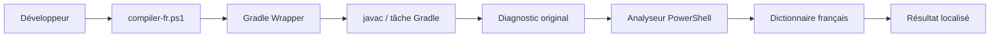

# Compilateur français pour Gradle

## A. Le problème initial

Compiler, c'est vérifier que le texte Java peut devenir un programme exécutable. `javac` lit les classes Java et signale les erreurs de syntaxe ou de types. Gradle organise ce travail : il télécharge les bibliothèques, lance les tâches et appelle le compilateur. Le Gradle Wrapper (`gradlew` ou `gradlew.bat`) est le petit lanceur fourni par le dépôt : il utilise la bonne version de Gradle sans installation globale. Spring Boot est une bibliothèque et un outil de démarrage pour l'application, mais il ne remplace ni `javac` ni Gradle. Les messages sont souvent en anglais car ces outils sont développés et distribués ainsi.

## B. L'idée de la solution

`javac` est comme un médecin qui produit un diagnostic technique. `compiler-fr.ps1` est l'interprète spécialisé : il lance le vrai examen, lit le diagnostic, le reformule en français, montre l'endroit concerné et propose un premier contrôle. Il ne remplace pas Java, Gradle ou Spring Boot ; le code de sortie de Gradle reste donc la source de vérité.

## C. Architecture complète



- `compiler-fr.ps1` choisit la tâche et restitue exactement le code de sortie Gradle.
- `CompilerFr.Core.psm1` lance le Wrapper, capture stdout/stderr, retire les séquences ANSI, analyse et affiche.
- `diagnostics.fr.json` est le dictionnaire extensible des motifs anglais et des explications françaises.
- `CompilerFr.Tests.ps1` teste le parseur et le traducteur sans modifier le code de production.

Le lancement par script est retenu plutôt qu'une tâche Gradle : le script peut observer et traduire la sortie du processus Gradle sans modifier son cycle de build ni risquer une boucle de tâches.

## D. Explication étape par étape

`compiler-fr.ps1` accepte `-Action`, convertit `compile` en `compileJava`, `run` en `bootRun`, puis appelle le module. Il utilise `gradlew.bat` sous Windows et `gradlew` ailleurs. `Invoke-CompilerFrGradle` démarre ce programme avec les flux standard redirigés ; `ExitCode` est renvoyé par le script avec `exit`, sans le remplacer.

`Remove-CompilerFrAnsi` supprime les couleurs terminal pour que les expressions régulières restent fiables. `ConvertTo-CompilerFrDiagnostics` reconnaît la forme javac `fichier:ligne: error: message`. Le motif emploie `.+?` pour accepter aussi `C:\dossier\fichier.java` : il s'arrête au segment `:nombre:` final, pas aux deux-points du disque Windows. Les lignes suivantes sont gardées pour lire `symbol: variable ...`, la ligne de source et le curseur `^`.

La colonne est celle fournie par javac ou, plus souvent, l'index du `^` plus un. `Get-CompilerFrCodeExcerpt` relit le fichier quand il existe, affiche `ligne | code`, puis ajoute des espaces égaux à la largeur du préfixe et à `colonne - 1` avant `^ ici`. Les tabulations sont affichées comme quatre espaces afin que le curseur reste utile.

`Resolve-CompilerFrDiagnostic` cherche la première règle du JSON qui correspond au message et aux détails. Pour `cannot find symbol`, il extrait notamment `symbol: variable academicYearId`. Une erreur sans règle reste volontairement technique : l'outil ne prétend pas savoir ce qu'il ne reconnaît pas.

## E. Installation et utilisation

Prérequis : Java 21 fourni par la toolchain du projet, PowerShell sous Windows (ou PowerShell 7 sous Linux/macOS) et le Wrapper présent dans le dépôt. Aucun module PowerShell ni Gradle global n'est requis.

Sous Windows, depuis la racine du projet :

```powershell
.\compiler-fr.ps1 -Action compile
.\compiler-fr.ps1 -Action test
.\compiler-fr.ps1 -Action run
.\compiler-fr.ps1 -Action build
.\compiler-fr.ps1 -Action clean
powershell -ExecutionPolicy Bypass -File .\tools\compiler-fr\tests\CompilerFr.Tests.ps1
```

Sous Linux/macOS, rendez le Wrapper exécutable si besoin (`chmod +x gradlew`), puis lancez `pwsh ./compiler-fr.ps1 -Action compile`. Ajoutez `-MasquerSortieTechnique` si vous voulez seulement le rapport français. Si PowerShell bloque les scripts locaux, utilisez temporairement `-ExecutionPolicy Bypass` au lieu de modifier une politique machine.

## F. Exemples avant/après

- `cannot find symbol` devient **symbole introuvable** : la variable ou méthode n'est pas visible dans cette portée ; vérifiez déclaration, paramètre ou import.
- `incompatible types` devient **types incompatibles** : une valeur ne peut pas être employée comme le type attendu.
- `is not abstract and does not override abstract method` devient **méthode abstraite non implémentée**.
- `package ... does not exist` devient **package ou import introuvable** : vérifiez l'import et la dépendance.
- `';' expected` devient **point-virgule manquant**.

Chaque rapport localisable affiche fichier, ligne, colonne, catégorie, cause, correction, code et `^ ici`.

## G. Ajouter une nouvelle traduction

1. Récupérez le diagnostic anglais complet.
2. Isolez sa partie stable.
3. Ajoutez une entrée dans `tools/compiler-fr/diagnostics.fr.json` avec `pattern`, `category`, `message`, `cause` et `correction`.
4. Utilisez une expression régulière pour les valeurs changeantes ; l'outil extrait déjà le symbole de `cannot find symbol`.
5. Rédigez un message français, une cause et une correction prudente.
6. Ajoutez un cas dans `tools/compiler-fr/tests/CompilerFr.Tests.ps1`.
7. Exécutez le script de tests et `./gradlew test`.

## H. Limites de la solution

Une erreur inconnue peut rester en anglais dans son diagnostic technique. Une erreur de compilation n'est pas une exception au démarrage. Certaines erreurs Spring Boot, de base de données ou de configuration ne possèdent pas une ligne Java précise. Une correction proposée est une hypothèse raisonnable, pas une modification automatique. Des erreurs Gradle peuvent apparaître avant `javac` et rester non localisables.

## I. Différence entre les catégories d'erreurs

- **Syntaxe** : le texte Java est mal formé (`;`, `)`, `}`).
- **Compilation** : le code est bien lu mais les types, symboles ou contrats ne correspondent pas.
- **Gradle** : le build ou une tâche ne peut pas être préparé.
- **Dépendance** : une bibliothèque ou un plugin ne peut pas être trouvé.
- **Test** : le code compile mais une vérification automatisée échoue.
- **Exécution** : une exception arrive pendant le fonctionnement.
- **Configuration Spring Boot** : une propriété, un bean ou un profil est incorrect.
- **Base de données** : connexion, requête ou schéma échoue.

## J. Exercices Feynman

1. Expliquez le Wrapper : *solution* : il télécharge et lance la version de Gradle choisie par le projet.
2. Ajoutez une traduction : *solution* : ajoutez une règle JSON puis un test avec le diagnostic original.
3. Retrouvez `cannot find symbol` : *solution* : lisez le nom après `symbol:` puis cherchez déclaration, paramètre et import.
4. Une classe existante crée-t-elle une variable locale ? *solution* : non ; une variable doit être déclarée ou reçue dans la méthode.
5. Testez une erreur inconnue : *solution* : envoyez une ligne `fichier:ligne: error: message nouveau` et vérifiez `Known = false`.

## K. Résumé ultra-simple

Lancez `compiler-fr.ps1` au lieu d'appeler Gradle directement quand vous voulez un rapport français. Le vrai compilateur continue de faire le travail. Le script traduit des erreurs connues, montre leur emplacement et garde le code de sortie original. Les erreurs inconnues restent visibles avec leur texte technique. Pour enrichir l'outil, ajoutez une règle JSON et un test.